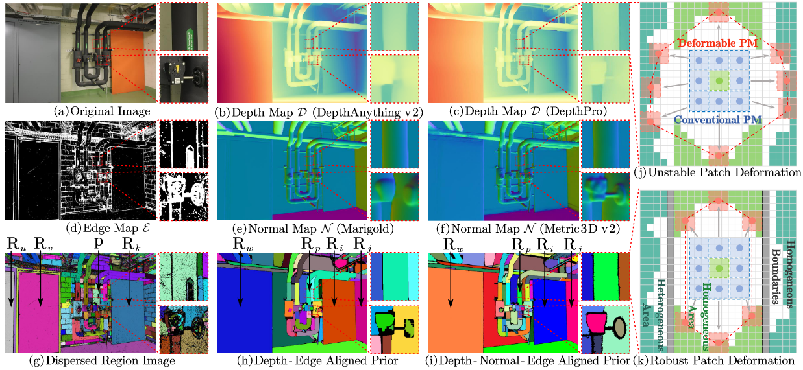

# MSP-MVS++

Yuan, Z., Zhang, D., Li, Z., Qian, C., Chen, J., Chen, Y., Chen K., Mao T., Li Z, Jiang H., Wang, Z., [**DVP-MVS++: Synergize Depth-Normal-Edge and Harmonized Visibility Prior for Multi-View Stereo**](https://arxiv.org/abs/2506.13215).


## About
DVP-MVS++ is an innovative approach that synergizes both depth-normal-edge aligned and harmonized cross-view priors for robust and visibility-aware patch deformation.

If you find this project useful for your research, please cite:  

```
@article{yuan2025dvp,
  title={DVP-MVS++: Synergize Depth-Normal-Edge and Harmonized Visibility Prior for Multi-View Stereo},
  author={Yuan, Zhenlong and Zhang, Dapeng and Li, Zehao and Qian, Chengxuan and Chen, Jianing and Chen, Yinda and Chen, Kehua and Mao, Tianlu and Li, Zhaoxin and Jiang, Hao and others},
  journal={arXiv preprint},
  year={2025}
}
```
## Code
Code is coming soon.

## Acknowledgements

This code largely benefits from the following repositories: [APD-MVS](https://github.com/whoiszzj/APD-MVS), [Semantic-SAM](https://github.com/UX-Decoder/Semantic-SAM) and [ACMMP](https://github.com/GhiXu/ACMMP.git). Thanks to their authors for opening the source of their excellent works.
